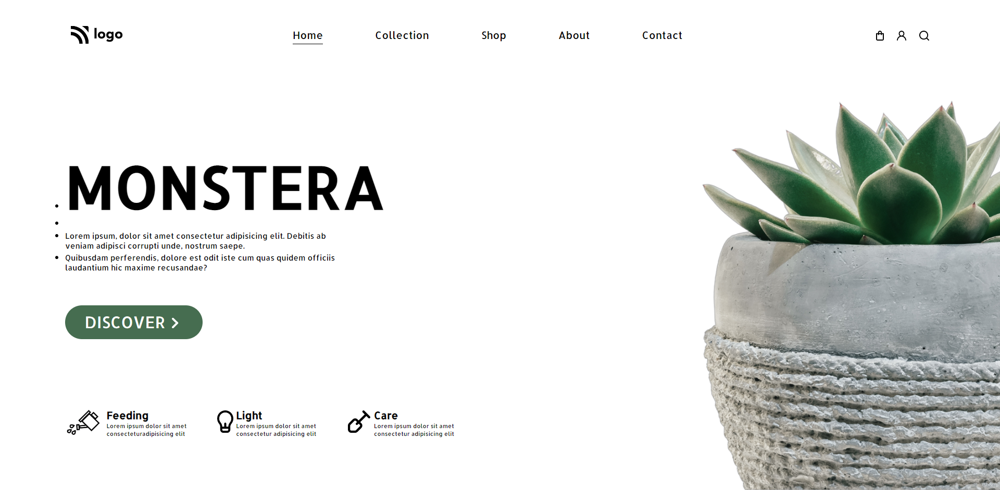

# Plant Home Page

## :link: [See it live](https://fullstack-js-bc-project-06.netlify.app/)

## :clipboard: Learning Outcomes 

- Use of pseudo-classes and psuedo-elements together
- Use of `::marker` pseudo-element
- Positioning and resizing of images

## :camera: Screenshot

